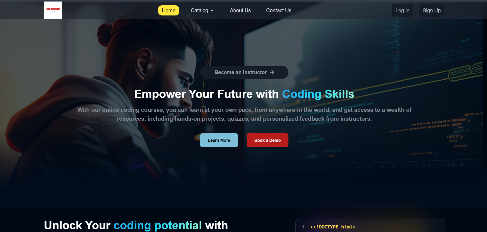
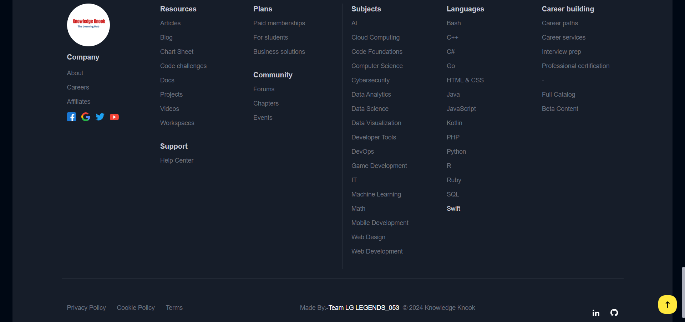

# Project Description 📝

Knowledge Knook is a fully functional edu-tech platform that enables users to create, consume, and rate educational content.
 
This platform is built using the **MERN stack**, which includes ReactJS, NodeJS, MongoDB, and ExpressJS.

<h2>Live link 🌍📡 - [ ]</h2>

| Section                                        | Description                            |
| ---------------------------------------------- | -------------------------------------- |
| [Knowledge Knook](#knowledge-knook-goals-📚)   | 📚 Overview of Knowledge Knook goals   |
| [Tech Stack](#tech-stack-)                     | 💻🔧 Technologies used in the project  |
| [System Architecture](#system-architecture-)   | 🏰 Overview of the system architecture |
| [Architecture Diagram](#architecture-diagram-) | 🏗️ Diagram explaining the architecture |
| [Schema](#schema-)                             | 🗂 Explanation of data schemas used     |
| [React Hooks](#react-hooks-)                   | 🎣 Overview of React Hooks used        |
| [React Library](#react-library-)               | ⚛️📚 Overview of React Libraries used  |
| [Screen Preview](#screen-preview-)             | 🖥️ Screen Preview                      |

## Knowledge Knook Goals 📚

1️⃣ A seamless and interactive learning experience for students, making education more accessible and engaging. 
2️⃣ A platform for instructors to showcase their expertise and connect with learners across the globe. 

## Tech Stack 💻🔧

### Frontend 🎨 :

<code title="React.js"></code>
<code title="Vite"></code>
<code title="Redux.js"></code>
<code title="css"></code>
<code title="Tailwind css"></code>

### Backend ⚙️ :

<code title="Nodejs"></code>
<code title="Express"></code>

### Database 🛢️ :

<code title="Mongodb"></code>

### Cloudinary Integration ☁️

<code title="Cloudinary"></code>

## System Architecture 🏰

☝ Knowledge Knook edu-tech platform and consists of three main components:  
The front end, the back end, and the database. The platform follows a client-server architecture, with the front end serving as the client and the back end and database serving as the server.

### 🎨 Front-end

The front end of the platform is built using ReactJS, which is a popular JavaScript library for building user interfaces. ReactJS allows for the creation of dynamic and responsive user interfaces, also **Loading Skeleton**, which are critical for providing an engaging learning experience to the students. The front end communicates with the back end using RESTful API calls.

### ⚙️ Back-end

The back end of the platform is built using NodeJS and ExpressJS, which are popular frameworks for building scalable and robust server-side applications. The back end provides APIs for the front end to consume, which include functionalities such as user authentication, course creation, and course consumption. The back end also handles the logic for processing and storing the course content and user data.

### 🛢️ Database

The database for the platform is built using MongoDB, which is a NoSQL database that provides a flexible and scalable data storage solution. MongoDB allows for the storage of unstructured and semi-structured data, which is useful for storing course content such as videos, images, and PDFs. The database stores the course content, user data, and other relevant information related to the platform.

## Architecture Diagram 🏗️

Here is a high-level diagram that illustrates the architecture of the Knowledge Knook edu-tech platform:

## API Design

The Knowledge Knook platform's API is designed following the REST architectural style. The API is implemented using Node.js and Express.js. It uses JSON for data exchange and follows standard HTTP request methods such as GET, POST, PUT, and DELETE. Here is a sample list of API endpoints and their functionalities:

1. `/api/auth/signup` (POST) - Create a new user (student or instructor) account.
2. `/api/auth/login` (POST) – Log in using existing credentials and generate a JWT token.
3. `/api/auth/verify-otp` (POST) - Verify the OTP sent to the user's registered email.
4. `/api/auth/forgot-password` (POST) - Send an email with a password reset link to the registered email.
5. `/api/courses` (GET) - Get a list of all available courses.
6. `/api/courses/:id` (GET) - Get details of a specific course by ID.
7. `/api/courses` (POST) - Create a new course.
8. `/api/courses/:id` (PUT) - Update an existing course by ID.
9. `/api/courses/:id` (DELETE) - Delete a course by ID.
10. `/api/courses/:id/rate` (POST) - Add a rating (out of 5) to a course.
    Sample API requests and responses:
11. `GET /api/courses`: Get all courses
    - Response: A list of all courses in the database
12. `GET /api/courses/:id`: Get a single course by ID
    - Response: The course with the specified ID
13. `POST /api/courses`: Create a new course
    - Request: The course details in the request body
    - Response: The newly created course
14. `PUT /api/courses/:id`: Update an existing course by ID
    - Request: The updated course details in the request body
    - Response: The updated course
15. `DELETE /api/courses/:id`: Delete a course by ID
    - Response: A success message indicating that the course has been deleted.

## 🖥️ Screen Preview :

### Home Page Background 🏠

### About Page

### Contact Page

### Ai Content Page

### Footer

### 404 Page

